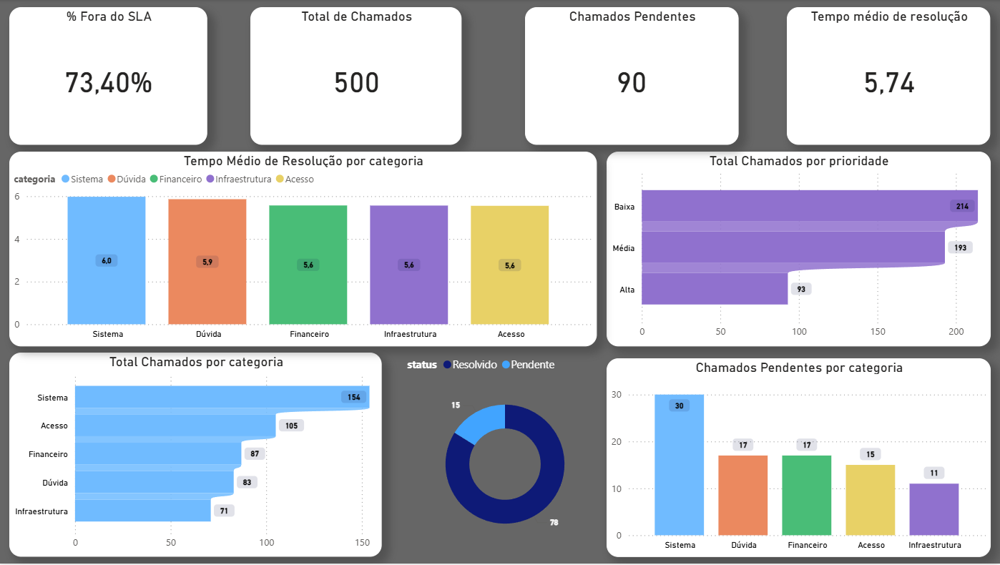

# 📊 Case – Análise de Chamados de Suporte Técnico

Este projeto consiste em um estudo de caso de análise de dados, desenvolvido para fins de portfólio, simulando um cenário real de uma operação de suporte técnico.

O objetivo é demonstrar minhas habilidades práticas em Power BI, SQL e Python, desde a organização dos dados até a geração de insights que auxiliam na tomada de decisão.

---

## 🎯 Objetivo do Projeto

- Analisar o desempenho do atendimento de suporte técnico
- Identificar gargalos operacionais e pontos de melhoria
- Avaliar cumprimento de SLA
- Explorar métricas relevantes para gestão de suporte

---

## 🧠 Perguntas de Negócio

- Qual é o tempo médio de resolução dos chamados?
- Quais categorias apresentam maior volume de chamados?
- Quais prioridades mais estouram o SLA?
- Existem categorias com maior tempo médio de atendimento?
- Como o desempenho varia ao longo do tempo?

---

## 🗂️ Fonte de Dados

Os dados utilizados são simulados, com o objetivo de representar um ambiente realista de atendimento de suporte técnico.

### Estrutura do dataset:
- `id_chamado`
- `data_abertura`
- `data_fechamento`
- `categoria`
- `prioridade`
- `status`
- `tempo_resolucao_horas`

---

## 📁 Estrutura do Projeto

- 📂 `dados` — Arquivos de dados em Excel
  - `chamados_suporte.xlsx`
- 📂 `python` — Notebook de análise  
  - `analise_suporte.ipynb`
- 📂 `powerbi` — Arquivo do dashboard Power BI  
  - `dashboard_chamados.pbix`  
- 📂 `imagens` — Print do dashboard
  - 
  
---

## 🛠️ Ferramentas Utilizadas

- **Power BI**
  - Tratamento de dados
  - Criação de medidas com DAX
  - Construção de dashboard interativo

- **SQL**
  - Análises exploratórias
  - Validação de métricas
  - Agregações e filtros por categoria e prioridade

- **Python**
  - Análise exploratória de dados (EDA)
  - Manipulação de dados com Pandas
  - Visualizações com Matplotlib/Seaborn

---

## 📈 Dashboard (Power BI)

O dashboard apresenta indicadores estratégicos, como:
- Total de chamados
- Tempo médio de resolução
- Percentual de chamados fora do SLA
- Distribuição por categoria e prioridade

---

## 🗄️ Análises Realizadas em SQL

O SQL foi utilizado para aprofundar a análise dos dados e validar padrões observados no dashboard.

### Exemplos de consultas:

#### Chamados com maior tempo de resolução
```
SELECT TOP 10
    id_chamado,
    categoria,
    prioridade,
    tempo_resolucao_horas
FROM chamados
ORDER BY tempo_resolucao_horas DESC
```

Tempo médio de resolução por categoria e prioridade
```
SELECT 
    categoria,
    prioridade,
    ROUND(AVG(tempo_resolucao_horas), 2) AS tempo_medio_resolucao
FROM chamados
GROUP BY categoria, prioridade
ORDER BY tempo_medio_resolucao DESC
```

Chamados fora do SLA por categoria
```
SELECT 
    categoria,
    COUNT(*) AS chamados_fora_sla
FROM chamados
WHERE tempo_resolucao_horas > 4
GROUP BY categoria
ORDER BY chamados_fora_sla DESC
```
